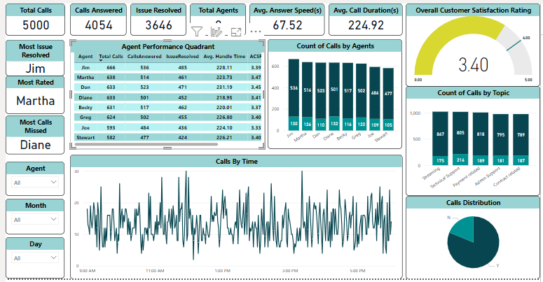
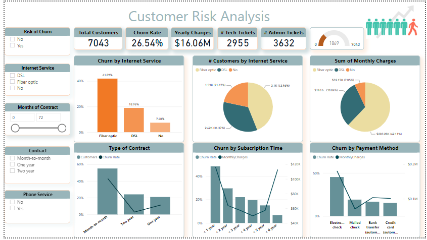
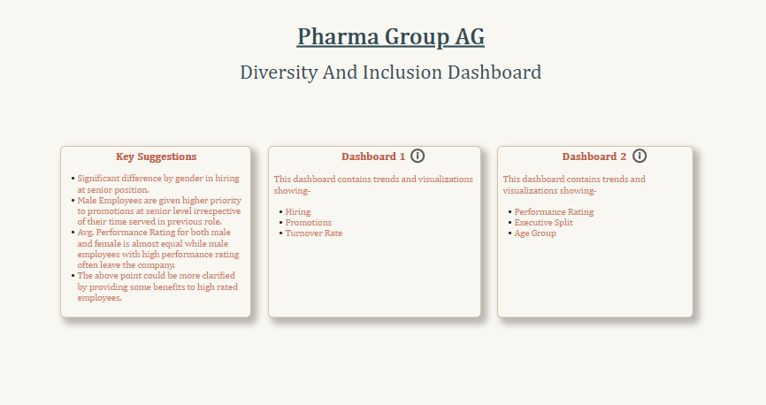
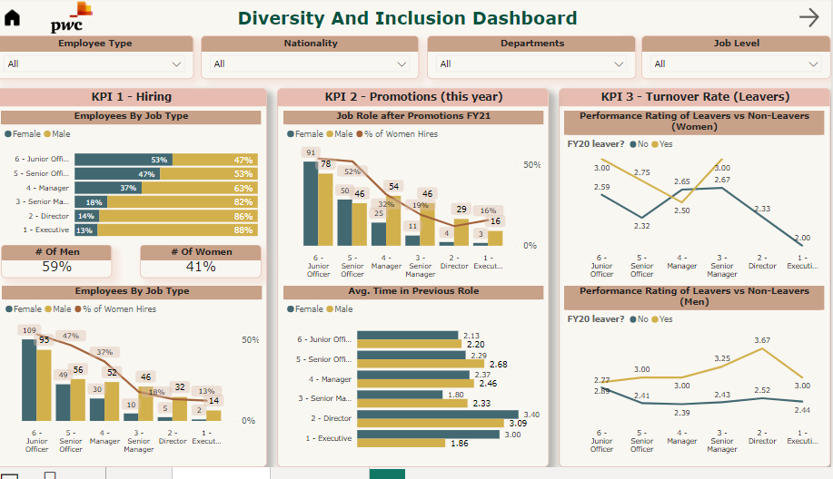

# **Analytics Portfolio**
## PWC Power BI Forage Internship

# Call Centre Trends Visualising customer and agent behavior.
Creating a comprehensive Power BI dashboard for Claire that reflects various relevant Key Performance Indicators (KPIs) and metrics can provide a clear overview of performance. Below, I'll outline the structure of the dashboard, including potential KPIs and metrics:
1. Overall customer satisfaction Overall calls answered/abandoned 
2. Calls by time Average 
3. Speed of answer Agent’s performance quadrant -> 
4. Average handle time (talk duration) vs. calls answered
The above dashboard provides Claire with a holistic view of call center performance, agent productivity, and customer satisfaction. It enables her to identify trends, areas for improvement, and top-performing agents. The interactivity and drill-down options empower her to explore data in detail, making informed decisions to optimize call center operations.

# Customer Retention Customer demographics and insights.
In this Task, I perform the following KPIs According to Client Requirements
1. Customers who left within the last month
2. Services each customer has signed up for phone, multiple lines, internet, online security, online backup, device protection, tech support, and streaming TV and movies
3. Customer account information: how long as a customer, contract, payment method, paperless billing, monthly charges, total charges, and number of tickets opened in the categories administrative and technical
4. Demographic info about customers – gender, age range, and if they have partners and dependents

This dashboard provides Janet, the Retention Manager at PhoneNow, with a comprehensive view of customer churn, service usage, demographics, and account information. It empowers her to identify patterns, demographics that might be more prone to churn, and areas for improvement in customer retention strategies. The interactivity and drill-down options enable her to explore data in detail to make data-driven decisions.

	
# Diversity & Inclusion Gender balance in the executive suite.
Improving gender balance at the executive management level and fostering diversity and inclusion in the workplace is indeed a complex endeavor that requires a strategic and multifaceted approach. Let's define relevant KPIs for hiring, promotion, performance, and turnover.

## Key Performance Indicators (KPIs):
### % of Hires Men and Women:
This KPI measures the gender composition of new hires. It helps assess the effectiveness of recruitment strategies in achieving gender diversity.

### Average Performance Rating New Hires: 
This KPI evaluates the performance of new hires based on their gender. It can highlight any disparities in performance evaluations during the onboarding phase.

### % of Employees Promoted: 
This KPI measures the overall promotion rate within the organization. A balanced promotion rate contributes to a diverse leadership pipeline.

### % of Women Promoted: 
This KPI specifically tracks the promotion rates of women within the organization, aiming to address the gender balance at higher levels.

### Average Performance Rating Men and Women:
This KPI assesses the average performance ratings of employees based on gender. It can reveal any gender-based performance disparities.
### % Turnover Men and Women:
This KPI measures the turnover rate of employees based on gender. High turnover rates for a particular gender can signal retention issues.

